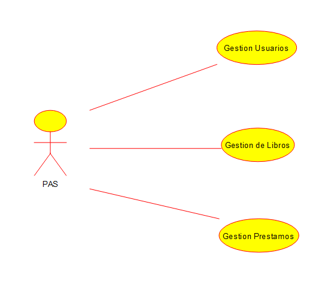
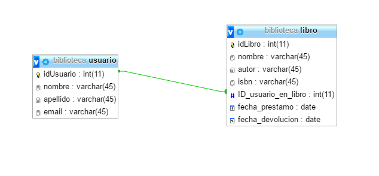
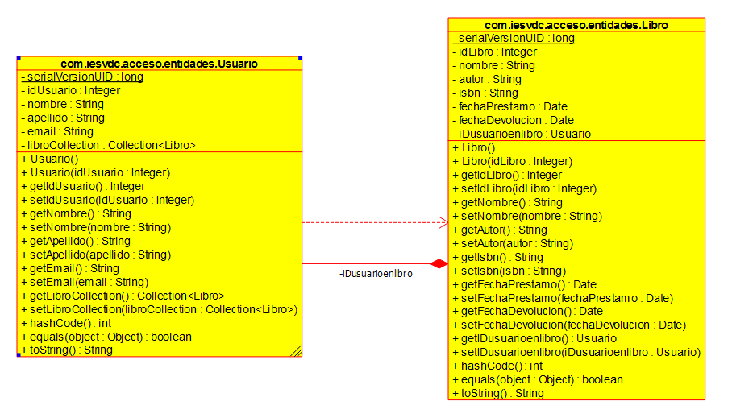

# Cliente REST

El presente proyecto de cliente REST forma parte de una de las tareas de 
la asignatura de Acceso a Datos del Ciclo Formativo de Grado Superior de 
Desarrollo de Aplicaciones Multiplataforma. 

## Introducción a la tarea

Básicamente se trata de crear un CRUD para usuarios, otro CRUD para libros, otro CRUD para prestamos y un maestro-detalle para ver préstamos/pedidos.

En cuanto al cliente, deberá ser en HTML5+JS (concretamente jQuery) y comunicarse con el servicio anterior en XML o en JSON.

## Documentación

### Casos de uso

### Diagrama entidad/relación

### Diagrama de clases
 

### Manual de instalación y configuración

